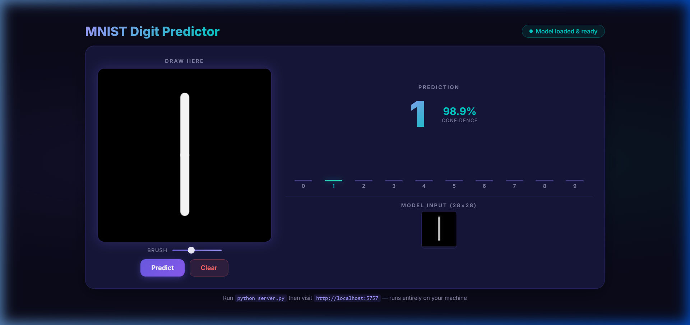

# MNIST Digit Classifier

A simple neural network built with **TensorFlow/Keras** to classify handwritten digits (0-9) from the [MNIST dataset](http://yann.lecun.com/exdb/mnist/).

## Demo



## Project Structure

| File | Description |
|---|---|
| `mnist.ipynb` | Jupyter notebook with data loading, training, and evaluation |
| `mnist.keras` | Saved trained model (Keras format) |
| `predict.html` | Interactive web app — draw a digit and get a prediction |
| `server.py` | Python backend that loads the model and serves predictions |

## Model Architecture

A Sequential neural network with 3 layers:

```
Flatten      → 28x28 image to 784-element vector
Dense(128)   → Hidden layer with ReLU activation
Dense(62)    → Hidden layer with ReLU activation
Dense(10)    → Output layer with Softmax (one per digit 0-9)
```

**Total Parameters:** ~109,108 trainable

## Training Details

- **Dataset:** MNIST (60,000 train / 10,000 test images, 28x28 grayscale)
- **Optimizer:** Adam
- **Loss:** Sparse Categorical Crossentropy
- **Epochs:** 4
- **Training Accuracy:** ~98.1%
- **Test Accuracy:** ~96.9%

## How to Run

### 1. Train the model (notebook)

```bash
pip install tensorflow matplotlib numpy
jupyter notebook mnist.ipynb
```

Run all cells to train and save the model as `mnist.keras`.

### 2. Use the interactive predictor (web app)

```bash
pip install pillow
python server.py
```

Then open **http://localhost:5757** in your browser. Draw a digit on the canvas and click **Predict**.

> **Note:** The app uses a lightweight Python server to load the saved Keras model. Everything runs locally on your machine.

## Requirements

- Python 3.8+
- TensorFlow 2.x
- Matplotlib
- NumPy
- Pillow
